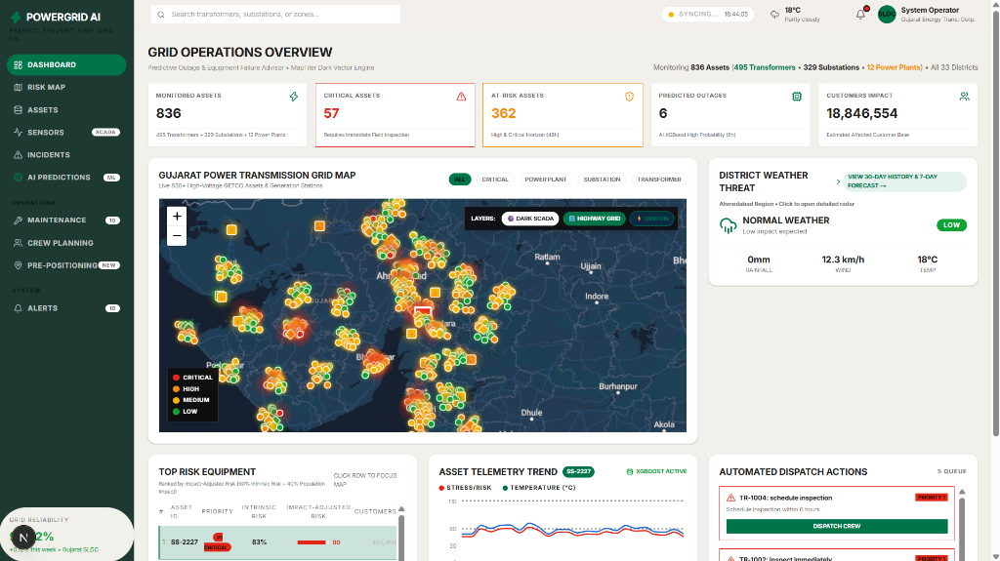
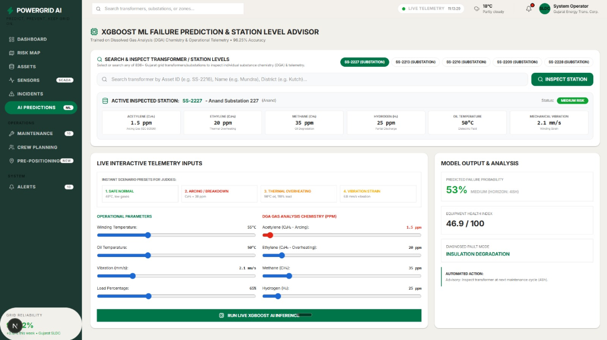
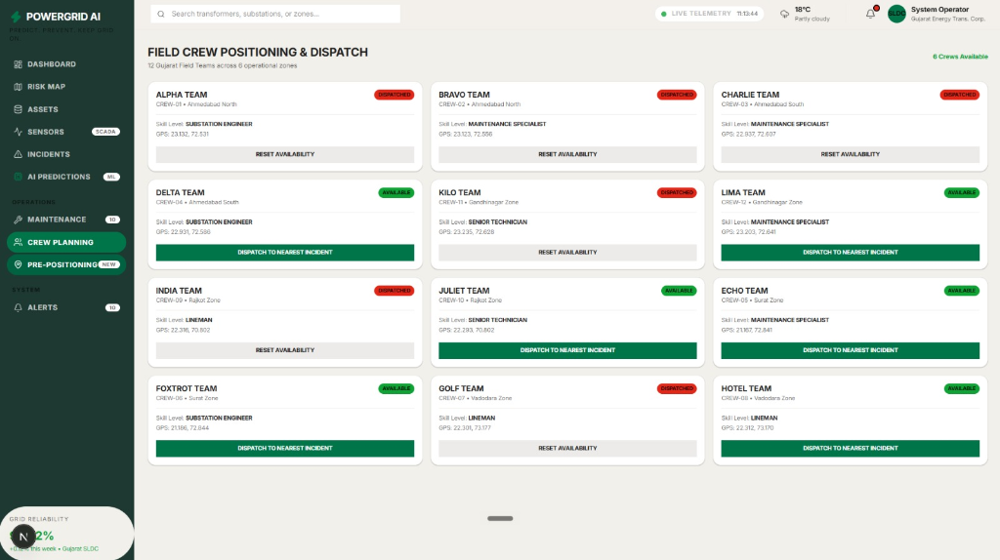
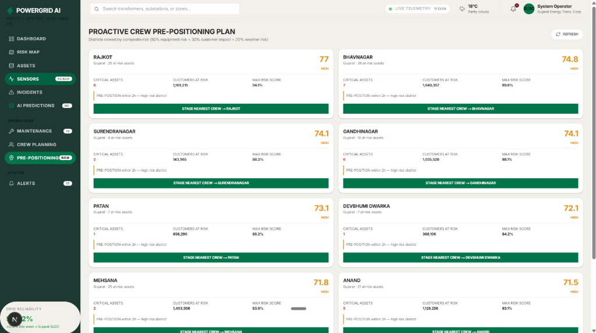
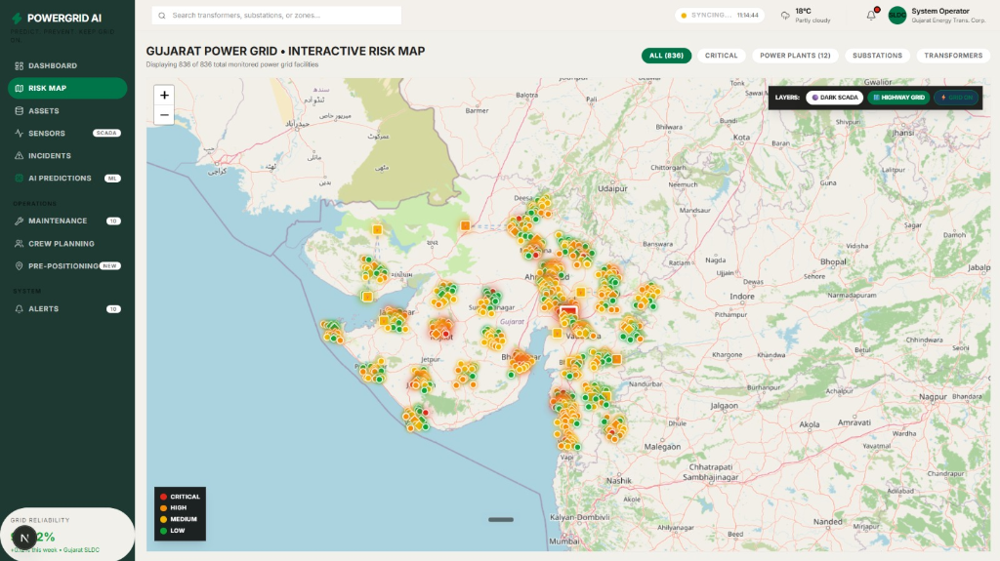

# ⚡ ThreatOps — Predictive Grid Outage & Equipment Failure Advisor

> **Predict. Prevent. Keep the Grid On.**  
> An enterprise AI-powered decision-support platform for modern electrical power grids that predicts high-voltage equipment failures, estimates outage impacts, maps 836+ transmission grid assets across Gujarat, and automates field crew dispatch before outages occur.

---

## 👥 Team & Hackathon Details

- **Team Name:** ThreatOps Team
- **Hackathon Track:** AI Track (**Bob AI Hackathon**)
- **Team Lead:** **Manthan Raithatha** (`manthan@example.com`)
- **Target Infrastructure:** High-Voltage Power Grids & Substations (836+ Monitored Gujarat Grid Assets)

---

## 📸 Platform Screenshots

| Dashboard Overview | AI Predictions Studio & DGA Inspector |
|---|---|
|  |  |

| Field Crew Dispatching | Proactive Crew Pre-Positioning Plan |
|---|---|
|  |  |

| Interactive Statewide GIS Risk Map |
|---|
|  |

---

## ❓ Problem Statement

High-voltage power transformers and substations are critical grid assets subject to severe thermal, electrical, and chemical stress. Grid operators currently face two major challenges:
1. **Reactive Emergency Response:** Equipment failures and Dissolved Gas Analysis (DGA) anomalies ($C_2H_2, C_2H_4, CH_4$) are often discovered only after an outage occurs, causing blackout risks and multi-million-dollar emergency replacement costs.
2. **Manual Sensor Log Correlation:** Correlating DGA gas chemistry reports ($C_2H_2$ Arcing, $C_2H_4$ Overheating, $CH_4$ Degradation), oil temperatures, and load telemetry manually takes **3+ hours per incident** across 12+ disconnected SCADA tools.

---

## 💡 Solution

ThreatOps is an end-to-end AI decision-support platform that ingests multi-sensor grid telemetry, evaluates DGA chemistry using a multi-class XGBoost machine learning model (achieving **96.25% test accuracy**), visualizes 836+ Gujarat grid assets on an interactive GIS map, and automates skill-optimized field crew dispatch prior to failure.

---

## 🌟 Key Features

1. **🤖 Machine Learning Failure Engine (XGBoost):**
   - **96.25% multi-class classification accuracy** across 6 fault states (*Safe Normal*, *Arcing / Partial Discharge*, *Thermal Overheating*, *Insulation Degradation*, *Dielectric Breakdown*, *Mechanical Strain*).
   - Provides failure probability scoring (0–100) and risk horizon predictions (`6h`, `24h`, `48h`, `7d`).

2. **🔍 Station-Level DGA Gas Inspector & Interactive Studio:**
   - Real-time substance level breakdown for Acetylene ($C_2H_2$), Ethylene ($C_2H_4$), Methane ($CH_4$), Hydrogen ($H_2$), Oil Temperature, and Winding Vibration.
   - IEC 60599 international safety compliance status badges (Normal, Warning, Critical) with instant SHAP feature explanations.

3. **🗺️ Interactive Statewide Gujarat GIS Map:**
   - Visualizes 836+ assets across all 33 Gujarat districts (including Mundra Thermal, Khavda Solar/Wind, Kakrapar Nuclear, Charanka Solar, Ukai Hydro).
   - MapTiler vector engine integration with animated 400kV/220kV transmission line corridors.

4. **⚡ District Weather Threat Radar:**
   - 30-day historical weather telemetry analysis and 7-day predictive weather risk forecasting per district.

5. **👥 Automated Field Crew Dispatch & Pre-Positioning:**
   - 12 Gujarat field crews across 6 operational zones assigned automatically based on geographic proximity and engineer specialization.

6. **⚙️ IBM Technology Integration:**
   - **IBM Bob AI:** Conversational assistant & CLI for natural language incident summaries and one-click runbook execution.
   - **watsonx.ai (Granite 3.0):** Model engine for multi-sensor root-cause classification and operator guidance.
   - **IBM Instana:** High-frequency SCADA telemetry ingestion connector for GETCO grid assets.

---

## 📐 Source Code Structure

For a detailed note on the repository architecture and component layout, refer to [`src/README.md`](src/README.md).

```
ThreatOps/
├── src/                      # Application source code (Frontend, Backend, Serverless API)
│   ├── frontend/             # Next.js 16 Web Dashboard with Leaflet GIS & Tailwind CSS
│   ├── backend/              # Python FastAPI REST Server & XGBoost ML Engine
│   └── api/                  # Vercel Serverless Function entrypoint
├── docs/                     # Setup, architecture, problem statement, and solution overview
├── demo/                     # Screenshots and demo video links
├── presentation/             # PowerPoint deck, Gamma script, and pitch scripts
├── submission.yaml           # Hackathon submission manifest
└── vercel.json               # Vercel production deployment configuration
```

---

## 🚀 How to Run Locally

For complete setup instructions, prerequisites, and environment variable setup, refer to [`docs/setup-guide.md`](docs/setup-guide.md).

```cmd
cd src
setup.bat
start.bat
```

- **Frontend Application:** [http://localhost:3000](http://localhost:3000)
- **FastAPI Backend:** [http://localhost:8000](http://localhost:8000)
- **Interactive API Docs:** [http://localhost:8000/docs](http://localhost:8000/docs)

---

## 📄 License & Hackathon Submission

Built for the **Bob AI Hackathon** (AI Track). All code and submission artifacts are submitted under open open-source guidelines.
