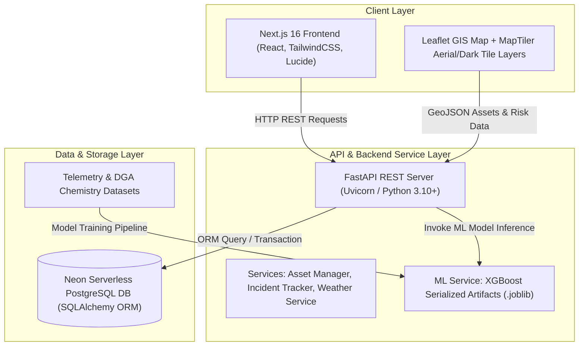

# Technical Architecture — PowerGrid Ai

## 🏗️ System Architecture Overview

ThreatOps uses a decoupled monorepo architecture with a Python FastAPI microservices backend, an XGBoost machine learning inference engine, a Neon Serverless PostgreSQL relational database, and a React / Next.js 16 App Router frontend with Leaflet GIS mapping.

---

## 💻 Component Breakdown

| Component | Technology | Responsibility |
|---|---|---|
| **Frontend UI** | Next.js 16 (App Router), React, Tailwind CSS | Multi-tab operational dashboard, AI studio controls, risk score visualization |
| **GIS Mapping** | Leaflet.js, MapTiler, GeoJSON | Real-time map rendering of 836+ Gujarat grid nodes & animated transmission lines |
| **Backend REST API** | Python 3.10+, FastAPI, Uvicorn, Pydantic | REST endpoints for asset telemetry, risk calculations, crew dispatch, weather integration |
| **ML Failure Engine** | XGBoost, scikit-learn, joblib, SHAP | 96.25% accuracy multi-class DGA fault prediction & feature importance attribution |
| **Database Layer** | Neon Serverless PostgreSQL, SQLAlchemy | Relational storage for grid assets, historical DGA telemetry, incidents, and field crews |

---

## 🔄 End-to-End Data Flow

1. **Telemetry Ingestion & Storage:** Sensor streams (oil temp, DGA gas ppm, load %, vibration) are periodically ingested or generated for 836+ Gujarat grid assets and stored in Neon Postgres.
2. **Real-Time Risk Calculation:** When requested by the frontend or background monitors, `/api/predictions/live/{asset_id}` retrieves the latest sensor metrics.
3. **XGBoost Inference:** The telemetry array is passed into the pre-trained XGBoost pipeline. The model computes:
   - Multi-class fault mode (Arcing, Overheating, Degradation, Mechanical, Normal)
   - Failure probability & Health Index score (0–100)
   - Risk horizon window (`6h`, `24h`, `48h`, `7d`)
4. **GIS Rendering:** The Next.js frontend fetches GeoJSON risk data from `/api/dashboard/risk-map` and renders animated pulsing radar indicators over affected substations.
5. **Actionable Response:** Operators inspect recommendations and dispatch assigned field crews via `/api/crews/dispatch`.
